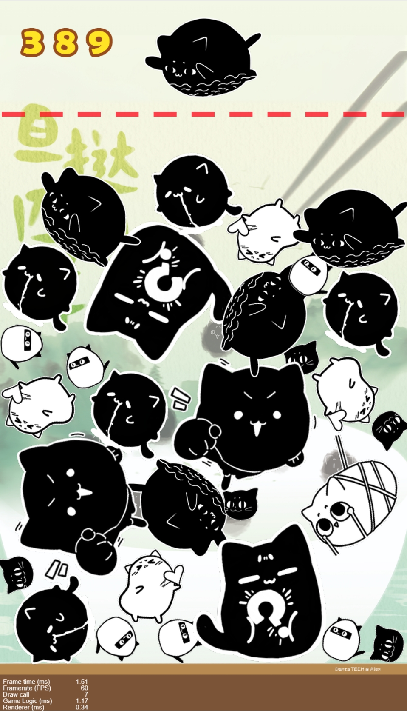

# Create Danta Mao-Mao
> By: A1ex

> Date: April 2025

This project is designed for creating **Danta Mao-Mao** to celebrate the **4th Danta TECH anniversary**. The original "daxigua" game was developed by `Shenzhen Biyi Interactive Co. Ltd Company` using `Cocos Creator v2.2.2`, and this project utilizes the `Cocos Creator v2.4.3 version`.

## Development Environment Setup
The DashBoard downloaded in this project functions as both a version manager and a project manager for Cocos Creator. You can download it from the official Cocos Creator website (https://www.cocos.com/creator). After installing the DashBoard, you need to further download and install the corresponding Cocos Creator v2.4.3 editor to start project development.

## Release Instructions
Currently, the available native platforms include Android, iOS, Mac, and Windows. This multi-platform support enables developers to publish projects developed with Cocos Creator ***across different devices and operating systems***, significantly expanding the project's reach.

It should be noted that the options for publishing to iOS, Mac, and Windows are only available within their respective operating systems ([release a game on Web platform](https://docs.cocos.com/creator/2.4/manual/zh/publish/publish-web.html)).

## 1. Reference Project
The reference project is hosted on GitHub: [yieio/daxigua](https://github.com/yieio/daxigua.git)

## 2. Modification
### 2.1 Mao-Mao Logo Changes
A total of 11 Mao-Mao logos were changed. The following Python scripts were used to handle the logo modifications:
```bash
# Rename the Danta images
python dantaImg_rename.py
# Convert the Danta images to the required format
python dantaImg_convertor.py
# Copy the processed Danta images to the appropriate location
python dantaImg_cp.py
```
### 2.2 Background Changes
To change the background, the following Python script was executed:
```
python danta_changeBg.py
```
### 2.3 Game Setting Modifications
In the `assets/Script/MainGame.ts` file, the game settings were adjusted. The following code snippet is responsible for generating new fruits at specific intervals. It uses a conditional logic to determine the type of fruit to create based on the current count of created fruits (`t.createFruitCount`), and it schedules the fruit creation operation to occur every 0.5 seconds:
```java
// Schedule a function to be executed once after 0.5 seconds
this.scheduleOnce(function () {
    // Check the current count of created fruits and create a new fruit accordingly
    if (0 === t.createFruitCount) {
        t.createOneFruit(0);
        t.createFruitCount++;
    } else if (1 === t.createFruitCount) {
        t.createOneFruit(0);
        t.createFruitCount++;
    } else if (2 === t.createFruitCount) {
        t.createOneFruit(1);
        t.createFruitCount++;
    } else if (3 === t.createFruitCount) {
        t.createOneFruit(2);
        t.createFruitCount++;
    } else if (4 === t.createFruitCount) {
        t.createOneFruit(2);
        t.createFruitCount++;
    } else if (4 < t.createFruitCount && 9 > t.createFruitCount) {
        t.createOneFruit(3);
        t.createFruitCount++;
    } else if (t.createFruitCount > 8) {
        // Randomly choose a type for the new fruit (index from 0 to 4)
        t.createOneFruit(Math.floor(Math.random() * 5));
        t.createFruitCount++;
    }
}, 0.5);
```
## 3. Screen Shoot
The following are screenshots of the modified Danta Maomao project. These screenshots showcase the visual changes made, including the new Mao-Mao logos and the updated background.
<figure class="half">



</figure>
<style>
img{
width: 60%;
padding-left: 20%;
}
</style>

---
